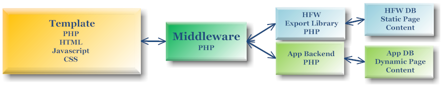

Check out our updated version for 2024!

Now easily supporting mulitple projects!

There is important documentation in the **install.docs** folder.

Please remove both **install** folders on any production machine, and any **readme** files and associated images.

This is the **Hoopla Framework** UI website.

Use the **Hoopla Framework** to create your websites.

It relies on some 3rd party HTML, JS and CSS.  See copyright and license information within each file.

<pre>
<a style="font-size: 16px; font-weight: bold;" href="https://www.hooplaframework.com">The Hoopla Framework Website!</a>
</pre>

We provide the blue blocks.  You can use the sample project as the starting point for everything else, or build your own middleware.  Use the HFW for building the structure of your web pages so they can handle your dynamic content.  This segregates your code so that your middleware and backend will have clear delineation.  However, the framework is very flexible, so use it as much or as little as you like.  The dynamic content of your app (if there is any), will also be in its own code base, and properly segregated.  Of course, by static content, we mean that you will have something like a div tag or table row on your page, but the dynamic content will fill them out and determine how many of each there are.  Static also implies that the HFW DB will not be altered when used on a production server and is read only.